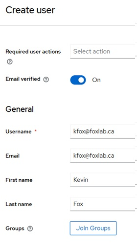

# Overview
I wanted to have an Identity Provider that I could _spin up_ relatively quickly - so, Keycloak (https://www.keycloak.org/)

Additionally, I work/play a lot with AWS, and didn't find a lot of documentation on how to get Keycloak properly working with AWS IAM Identity Center.

This repo gives a rundown on how to deploy a Keycloak server into an AWS account and will also cover how to configure the AWS Identity Center side as well as the Keycloak side to allow SSO for your Keycloak users.

## Requirements

- You have an active AWS account and are relatively familiar with how to use it
- You have some familiarity with Terraform and how to run plans
- Your Terraform setup can _reach_ your AWS environment programmatically

## Assumptions
The Terraform script assumes you have a Route53 zone setup and at your disposal. If you don't you'll need to modify the Terraform script to not use Route53, and you'll most likely have to modify the ```cloud-init-keycloak.sh``` script to not automatically get an SSL certificate (as that needs a DNS name in place). Just create a DNS record wherever you want to, point it at the server, and run the certbot command manually on the system afterwards.
You can certainly run Keycloak without an SSL cert, but that requires some other nonsense that I've since forgotten (and I didn't test this setup without a cert).

## Warnings
I use a password of 'password' everywhere for this. Obviously if you're going to do anyting _real_ with this environment, review everything and make it _production ready_.

None of the below is inherently destructive, but there is a point where you modify AWS IAM Identity Center's Identity source. If you're in an existing environment and blindly change identity sources, that could be a bad thing. As always, understand what you're running in any of your environments...even if it's just for testing.

# Walkthrough

## Keycloak Terraform Deploy

Before you run any Terraform commands, take a look at ```terraform.tfvars``` and update any relavant information.

Once the variables are updated, run the following terraform commands to get moving with Terraform:

```terraform init```

```terraform plan```

```terraform apply```

This will take about 5 minutes or so, but eventually you should be able to access the server via HTTPS.

If you're a Chrome user and you ran certbot in staging mode, you'll need to use incognito to get at the site.

Once the site's up, log in using ```admin``` and ```password``` (assuming you didn't modify that).

## AWS Identity Center Setup

Log into your AWS account, and head on over to "IAM Identity Center".

If you haven't yet enabled Identity Center, it will look like this:

</a>

 There are some things to consider when enabling Identity Center. Nothing _earth shattering_, but it does shift a few things around: https://docs.aws.amazon.com/singlesignon/latest/userguide/identity-center-prerequisites.html

 Assuming Identity Center is enabled, head on over to "Settings" and select "Change identity source" under "Actions":

 </a>

Select "External identity provider", and click "Next"

Download the metadata file locally (e.g. ```aws-metadata.xml```)

## Keycloak IdP Setup

Back on over to your Keycloak instance, select "Clients" on the left menu, and select "Import client":

</a>

Select "Browse..." on the next screen, and upload your ```aws-metadata.xml``` file.

You can give it a friendly name if you want, otherwise just hit "Save".

Under "Realm settings" on the left menu, scroll all the way to the bottom, right-click "SAML 2.0 Identity Provider Metadat", and save that info locally (e.g. ```keycloak-metadata.xml```)

</a>

## AWS Identity Provider Finalization

Back over to AWS (assuming you didn't close that last screen), click the "Choose file" under "IdP SAML Metadata" and upload the ```keycloak-metadata.xml``` file.

Click "Next", review the details, type "ACCEPT" and click "Change identity source".

## AWS User Creation

Since Keycloak doesn't support SCIM by default (and I have yet to look into it), we'll need to create our user mappings manually in AWS.

Still in IAM Identity Center, select Users, and click "Add user".

__Important__: This tripped me up for longer than I'd like to admit. Keycloak will, by default, pass the user email address as the username identity, even if you setup your keycloak users with simple usernames. For example...I created a keycloak user with 'kfox' as the username, and 'kfox@foxlab.ca' as the email. I can authenticate with Keycloak using 'kfox', and even suring the SSO process, I will use 'kfox' to sign-in, but what gets sent over to AWS is 'kfox@foxlab.ca', and AWS expects that to be in the username field. I'll cover how to address this (if you want) below, but it wasn't obvious to me.

So, my user was setup as such:

</a>

Click "Next", "Next", and "Add user".

Once the user is added, they'll need some permissions 

## Keycloak User Creation

Over in Keycloak, select "Users" in the left menu, and click "Add user".

My user was setup as such:

</a>
